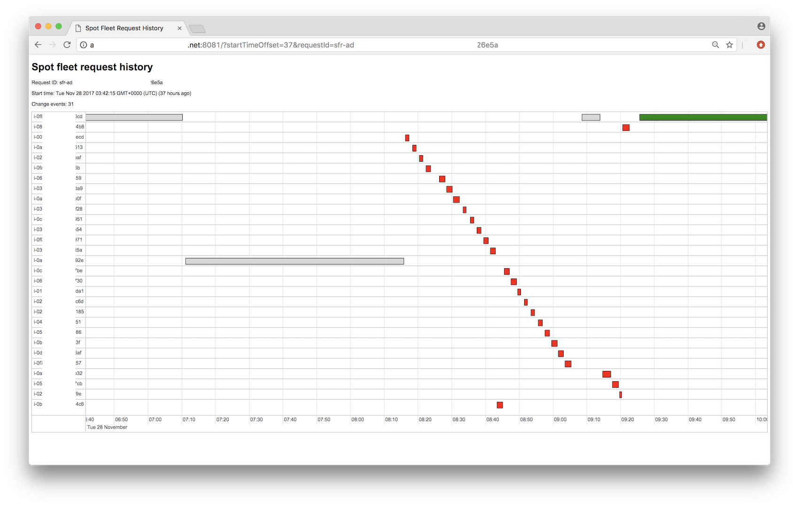

# Spot fleet request history visualiser

Uses [vis.js](http://visjs.org) to visualise EC2 instance launch, terminate and stop events created by a spot fleet request over time.



## Installation

```
git clone https://github.com/acbox/sfrhvis.git
cd sfrhvis
npm install
```

Now setup your AWS [Shared Credentials File](http://docs.aws.amazon.com/sdk-for-javascript/v2/developer-guide/loading-node-credentials-shared.html).

Optionally set default values for all requests in `config.json`:

```
{
  "listenPort": "8081",
  "region": "eu-west-1",
  "requestId": "sfr-9deaf2aa-4ba8-238c-18af-4bdf81b26e5a",
  "startTimeOffset": "36",
}
```

The `startTimeOffset` parameter specifies how many hours backwards from now you want to set the start time of the [spot fleet request history](http://docs.aws.amazon.com/AWSEC2/latest/APIReference/API_DescribeSpotFleetRequestHistory.html) API call. If you leave out the parameter from the config file and do not specify it in the query string (see below), it defaults to the current day at `00:00:00` (midnight).

## Usage

Start the server:

```
node sfrhvis.js
```

If you've set a default request ID in `config.json`, hit the server with no query parameters:

[http://127.0.0.1:8081/](http://127.0.0.1:8081/)

Otherwise change what you need:

[http://127.0.0.1:8081/?requestId=sfr-9deaf2aa-4ba8-238c-18af-4bdf81b26e5a&startTimeOffset=30&region=eu-west-1](http://127.0.0.1:8081/?requestId=sfr-9deaf2aa-4ba8-238c-18af-4bdf81b26e5a&startTimeOffset=30&region=eu-west-1)

The colour coding for instances on the timeline is as follows:

|Box colour|Change type|
|:------|:-----------|
|<span style="color:red">Red</span>|Terminated|
|<span style="color:gray">Gray</span>|Stopped|
|<span style="color:green">Green</span>|Running through end time|

## Notes

For reasons I don't yet understand, the [DescribeSpotFleetRequestHistory](http://docs.aws.amazon.com/AWSEC2/latest/APIReference/API_DescribeSpotFleetRequestHistory.html) API call is very picky about the start time. Too early or too late and you'll get no events. Tweak the `startTimeOffset` parameter until you get what you need.
